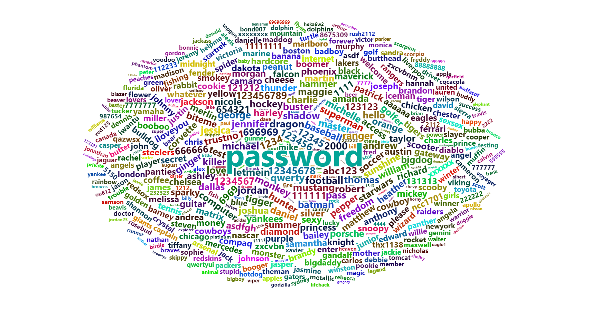
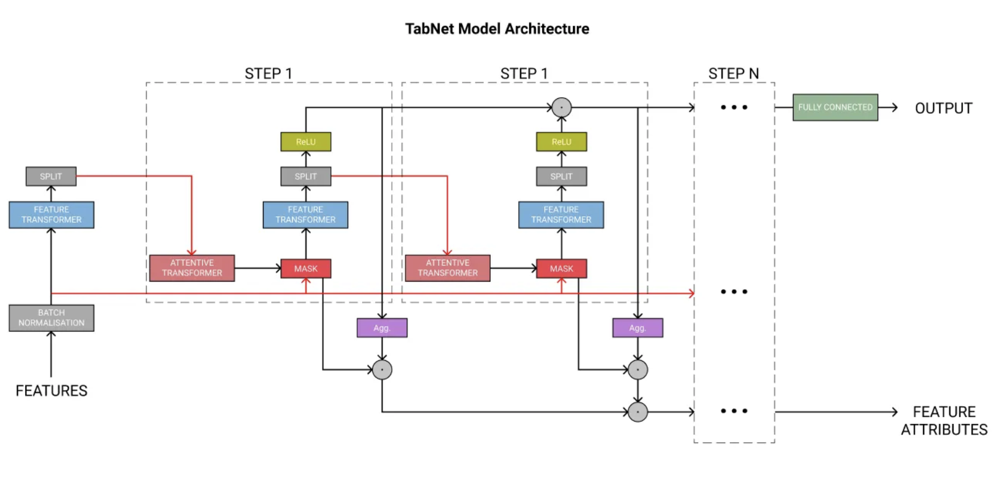
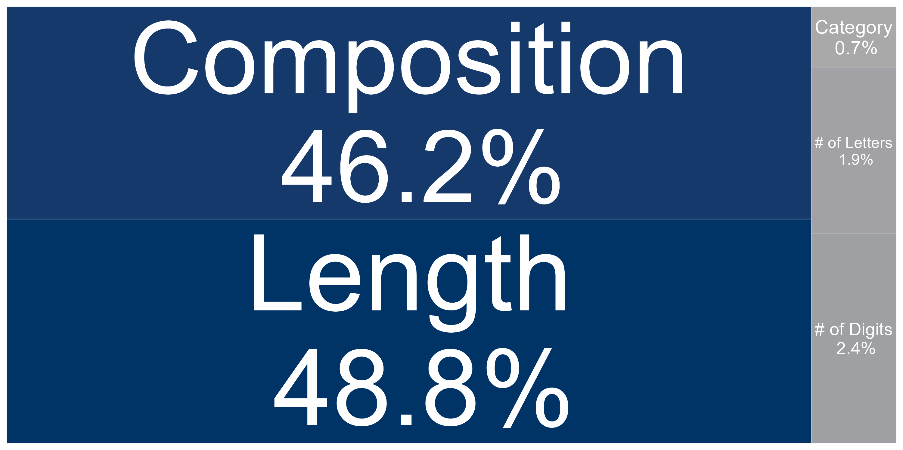
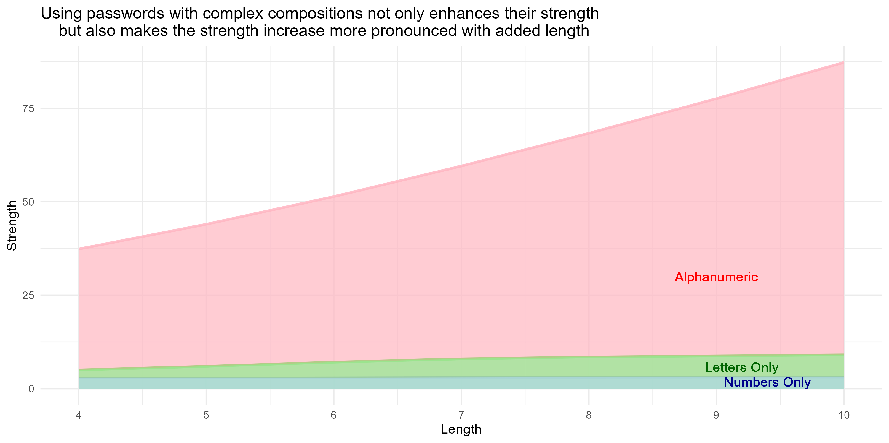
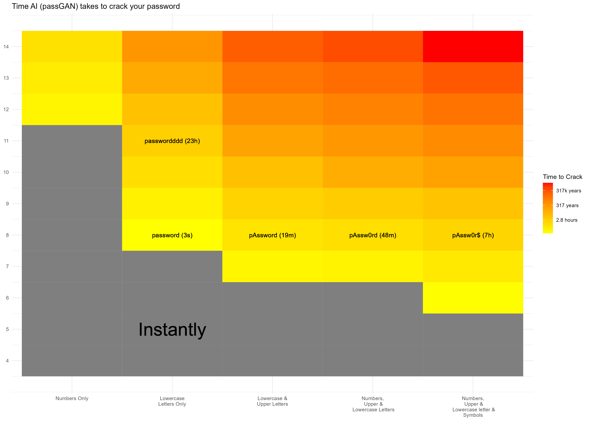

Final project of GLHLTH 562.

# Executive Summary

## Dataset

**Source:**
The data for this project was sourced from [Information is Beautiful (KIB)](https://www.informationisbeautiful.net/), a platform known for its compelling visualizations of various datasets. The specific dataset used here focuses on password strength and quality. The visual representation of this data can be found directly on the Information is Beautiful website under the respective password strength section.

**Data Dictionary:**

The dataset, `passwords.csv`, includes the following variables:

| Variable            | Class      | Description                                                                            |
|---------------------|------------|----------------------------------------------------------------------------------------|
| `rank`              | double     | Popularity rank based on the frequency of occurrence in databases of leaked passwords. |
| `password`          | character  | The actual text of the password.                                                       |
| `category`          | character  | Classification of the password (e.g., alphanumeric, numeric only, etc.).               |
| `value`             | double     | Estimated time required to crack the password through online guessing attacks.         |
| `time_unit`         | character  | Unit of time (seconds, minutes, hours) corresponding to the `value` field.             |
| `offline_crack_sec` | double     | Time it would take to crack the password offline, measured in seconds.                 |
| `strength`          | double     | A score indicating the quality of the password where 10 is highest and 1 is lowest, relative to other weak passwords in the dataset. |
| `font_size`         | double     | Font size used in creating the graphic for Information is Beautiful, not relevant for data analysis but useful for reproducing visualizations. |

**Additional data:**
There is another table in the `data` folder, `tabnet_ret.csv`. After using TabNet to build a password strength regression model, the strength of passwords that are not in the data set can be obtained. This table records the strength of passwords of different lengths and components predicted by TabNet.

## Research Question

1. What are the factors that affect password strength, and how important are these factors? I hope to explore the reasons behind the rules for setting passwords.

2. Faced with the challenge of AI cracking passwords, are current password rules still valid?

## Methodology

**Data Process**
The main data processing work of this project focuses on extracting features from passwords, such as password length, password component types, and the length of each component.

**Visualization**
The following types of plots were used during visualization:
1. Word Cloud
2. Interactive Scatter Plot
3. Text Bar Plot
4. Heat Map
5. Violin Plot
6. Semicircle Parliament Plot

**Modeling**
Established a password strength prediction model using TabNet, which integrates Decision Trees into Deep Neurual Networks. The architecture of TabNet is shown as below.

## Findings

1. Password strength is related to password length and component types, and is independent of category and the length of various components.

2. The complexity of password components is the foundation of strength. Only when passwords contain multiple types of characters, can the increase in length effectively reflect the impact on password strength.

3. Faced with the challenge of AI cracking passwords, increasing password length and character types is still an effective way to improve password strength, but it is obvious that longer lengths are needed to ensure password security

