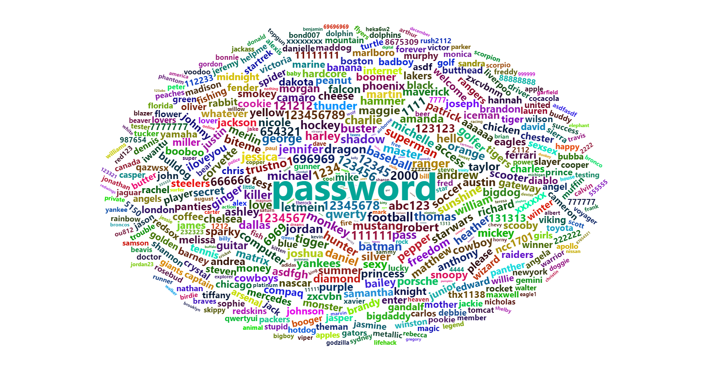

# PASSWORD

```{r setup, include=FALSE, warning = FALSE, message = FALSE}
  knitr::opts_chunk$set(echo = TRUE, warning = FALSE, message = FALSE)
  options(scipen=999) # turns off scientific notation
  
library(wordcloud2)
library(htmlwidgets)
library(knitr)
library(forcats)
library(dplyr)
library(ggtext)
library(VennDiagram)
library(grid)
library(gridExtra)
library(png)
library(ggparliament)
library(patchwork)
library(GGally)
library(rpart)
library(tidymodels)
library(dplyr)
library(stringr)
library(reshape2)

```

### P1: wordcloud figure of 500 passwords
```{r}
password_data <- read.csv("data/passwords.csv")

## Add a column length

words <- password_data$password

freqs <- 501 - password_data$rank

freqs <- sqrt(freqs)

freqs <- round(freqs / max(freqs) * 500)
freqs[1] <- freqs[1]+1000

word_freq <- data.frame(word=words, freq=freqs)

wordcloud <- wordcloud2(word_freq, size = 0.5, shape = "circle")
saveWidget(wordcloud, file="p1_wordcloud.html")


```

## General password preferences
### P2: Top 10 Passwords

Interactive figure for a quick view of top 10 passwords.
```{r}
library(plotly)
password_data_p1 <- password_data

generate_text_bar <- function(value, min_value, max_value, bar_length = 20) {
  value <- ifelse(value < min_value, min_value, value)
  value <- ifelse(value > max_value, max_value, value)
  relative_position <- round(((value - min_value) / (max_value - min_value)) * bar_length)
  bar <- paste0("||", strrep("-", relative_position), "|", strrep("-", bar_length - relative_position), "||")
  return(bar)
}

password_data_p1$length <- nchar(as.character(password_data_p1$password))
min_length <- min(password_data_p1$length)
max_length <- max(password_data_p1$length)
min_strength <- min(password_data_p1$strength)
max_strength <- max(password_data_p1$strength)


password_data_p1$length_bar <- sapply(password_data_p1$length, generate_text_bar, min_value = min_length, max_value = max_length)
password_data_p1$strength_bar <- sapply(password_data_p1$strength, generate_text_bar, min_value = min_strength, max_value = max_strength)


top_passwords <- head(password_data_p1, 10)
set.seed(10)  
top_passwords$x <- runif(n = 10, min = 5, max = 6)
top_passwords$y <- runif(n = 10, min = 5, max = 6)

top_passwords$hovertext <- paste('Password: ', top_passwords$password, 
                                 '\n\nCategory: ', top_passwords$category,
                                 '\n\nLength: ', top_passwords$length,
                                 '\n     ', top_passwords$length_bar, '    \n  short                  long',
                                 '\n\nStrength: ', top_passwords$strength,
                                 '\n     ', top_passwords$strength_bar, '    \n   low                     high', sep = "")

colors <- c('password-related' = 'red', 'simple-alphanumeric' = 'blue', 'animal' = 'green', 'sport' = 'orange')

p <- plot_ly(top_passwords, x = ~x, y = ~y, text = ~password, type = 'scatter', mode = 'text',
             textfont = list(size = 38, color = colors[top_passwords$category], family = "Arial Black, serif, bold"),
             hoverinfo = 'text',
             hovertext = ~hovertext)

p <- layout(p, title = 'Top 10 Passwords',
            xaxis = list(visible = FALSE, range = c(4.9, 6)),
            yaxis = list(visible = FALSE, range = c(4.9, 6)),
            hovermode = 'closest')

saveWidget(p, file = "./figures/p2_interactive_plot_top_10_passwords.html")

p


```


### P3: Password Distribution Across Categories (Part I)

```{r}


windowsFonts(p2Font = windowsFont("Cooper Black"))

password_data_p2 <- password_data %>%
  mutate(category = fct_infreq(category))

password_data_p2 <- password_data_p2 %>%
  group_by(category) %>%
  mutate(total = n(),  
         rank_in_category = rank(-rank, ties.method = "first"), 
         rank_y = total - rank_in_category + 1,  
         color = ifelse(rank == min(rank), 
                        paste0(category, "_top1"), 
                        paste0(category, "_other"))) %>%
  ungroup()

password_data_p2_reverse <- password_data_p2 %>%
  mutate(rn = row_number()) %>%
  arrange(desc(rn)) %>%
  select(-rn)

alpha_value <- 0.1
rainbow_colors <- rainbow(10)
color_values <- c(
  "name_top1" = rainbow_colors[1], "name_other" = alpha(rainbow_colors[1], alpha_value),
  "cool-macho_top1" = rainbow_colors[2], "cool-macho_other" = alpha(rainbow_colors[2], alpha_value),
  "simple-alphanumeric_top1" = rainbow_colors[3], "simple-alphanumeric_other" = alpha(rainbow_colors[3], alpha_value),
  "fluffy_top1" = rainbow_colors[4], "fluffy_other" = alpha(rainbow_colors[4], alpha_value),
  "sport_top1" = rainbow_colors[5], "sport_other" = alpha(rainbow_colors[5], alpha_value),
  "nerdy-pop_top1" = rainbow_colors[6], "nerdy-pop_other" = alpha(rainbow_colors[6], alpha_value),
  "animal_top1" = rainbow_colors[7], "animal_other" = alpha(rainbow_colors[7], alpha_value),
  "password-related_top1" = rainbow_colors[8], "password-related_other" = alpha(rainbow_colors[8], alpha_value),
  "food_top1" = rainbow_colors[9], "food_other" = alpha(rainbow_colors[9], alpha_value),
  "rebellious-rude_top1" = rainbow_colors[10], "rebellious-rude_other" = alpha(rainbow_colors[10], alpha_value)
)

# color_values <- c(
#   "name_top1" = "#FF4500", "name_other" = alpha("#FF4500", 0.15),
#   "cool-macho_top1" = "#006400", "cool-macho_other" = alpha("#006400", 0.15),
#   "simple-alphanumeric_top1" = "#00008B", "simple-alphanumeric_other" = alpha("#00008B", 0.15),
#   "fluffy_top1" = "#8B4513", "fluffy_other" = alpha("#8B4513", 0.15),
#   "sport_top1" = "#4B0082", "sport_other" = alpha("#4B0082", 0.15),
#   "nerdy-pop_top1" = "#B03060", "nerdy-pop_other" = alpha("#B03060", 0.15),
#   "animal_top1" = "#FFD700", "animal_other" = alpha("#FFD700", 0.15),
#   "password-related_top1" = "#CD5C5C", "password-related_other" = alpha("#CD5C5C", 0.15),
#   "food_top1" = "#2E8B57", "food_other" = alpha("#2E8B57", 0.15),
#   "rebellious-rude_top1" = "#4682B4", "rebellious-rude_other" = alpha("#4682B4", 0.15)
# )

## make the plot align upwards 
password_data_p2_reverse <- password_data_p2_reverse %>%
  mutate(
    name_total = ifelse(category == "name", total, NA), # Temporarily store 'name' total in each row
    name_total = max(name_total, na.rm = TRUE), # Replace NAs with the maximum 'name' total for all rows
    rank_in_category = ifelse(
      category != "name", 
      rank_in_category + (name_total - total), 
      rank_in_category
    )
  ) %>%
  select(-name_total)

password_data_p2_reverse$length <- nchar(password_data_p2_reverse$password)

p2 <- ggplot(password_data_p2_reverse) +
  geom_text(aes(x = category, y = rank_in_category, label = password, color = color), size = 4, family="p2Font") +
  scale_color_manual(values = color_values) +
  theme_minimal() +
  theme(axis.text.x = element_text(angle = 0, hjust = 0.5, vjust = 0.5), 
        legend.position = "none",
        plot.title = element_text(size = 14, face = "bold")) +
  labs(title = "Password Distribution Across Categories", x = NULL, y = NULL)

print(p2)

ggsave("p3.png", p2, width = 14, height = 8, dpi = 300)

```

### P3: Password Distribution Across Categories (Part II)

As can be seen from p3, passwords in different categories do not differ in length and strength, and are not factors that affect password security.

```{r}

## Add two violin plot (strength and length)
## length (0-70) strength(80-160)
## project length  (4-9) -> (0-85)
## project strength  (0-48) -> (90-170)


# Rescale 'length' column from 4-9 to 0-85
password_data_p2_rescaled <- password_data_p2_reverse

password_data_p2_rescaled$length <- (password_data_p2_rescaled$length - 4) * (85 - 0) / (9 - 4) + 0

# Rescale 'strength' column from 0-48 to 95-175
password_data_p2_rescaled$strength <- (password_data_p2_rescaled$strength - 0) * (175 - 95) / (48 - 0) + 90

p2_final <- p2 + 
  geom_violin(alpha = 0.6,data = password_data_p2_rescaled, aes(x = category, y = length, fill = category))+
  geom_violin(alpha = 0.6,data = password_data_p2_rescaled, aes(x = category, y = strength, fill = category))+
  # set y_tick
  # 0 17 34 51 68 85  95 115 135 155  175
  # 4 5  6  7  8  9   0  12 24   36   48
  scale_y_continuous(
    name = "Length                             Strength",
    breaks = c(0, 17, 34, 51, 68, 85,  95, 115, 135, 155, 175), 
    labels = c(4, 5, 6,  7,  8,  9,   0,  12, 24,   36,   48), # dual y axis, second y ticks for # of passwords
    sec.axis = sec_axis(~ 183 - ., name = "# of passwords")
  )+
  theme(
    # panel.background = element_rect(fill = "grey"),
        panel.grid.major = element_blank(), 
    panel.grid.minor = element_blank(),
    plot.caption  = element_markdown(margin = margin(t = 10), size = 6))+
    labs(size = 10,
         caption = paste0(
              "Source: <b>Information is Beautiful</b> | ",
              "Graphic: <b>SKN</b>"
          )) 

print(p2_final)


ggsave("./figures/p3_final.png", p2_final, width = 14, height = 8, dpi = 300)

```

### P4: Analyzing Password Security: A Comparative View of Strength and Vulnerability (Part I)
```{r}

color_num <- '#ff7f0e'
color_letter <- "#1f77b4"
color_alphanum <- "purple"

p3_1_data <- data.frame(
  name = c("Numbers only", "Alphanumeric", "Letters only"),
  number = c(446, 14, 40),
  color = c(color_num, color_alphanum, color_letter)
)


ru_semicircle <- parliament_data(election_data = p3_1_data,
                                 type = "classroom", # Parliament type
                                 parl_rows = 11,      # Number of rows of the parliament
                                 party_seats = p3_1_data$number) # Seats per party

p3_par <- ggplot(ru_semicircle, aes(x = x, y = y, colour = name)) +
  geom_parliament_seats() + 
  theme_ggparliament() +
  scale_colour_manual(values = p3_1_data$color, 
                      limits = p3_1_data$name) +
  labs(color = "Password Type")
print(p3_par)


```
### P4: Analyzing Password Security: A Comparative View of Strength and Vulnerability (Part II)
```{r}
password_data_p3 <- password_data

password_data_p3 <- password_data_p3 %>%
  mutate(pw_label = case_when(
    grepl("^[0-9]+$", password) ~ "Numbers",  
    grepl("^[A-Za-z]+$", password) ~ "Letters",  
    TRUE ~ "Alphanumeric"  
  ))

alpha_fill <- 0.25
alpha_color <- 0.45
  
p3_violin_strength <- ggplot(password_data_p3, aes(x = factor(pw_label), y = strength, fill = factor(pw_label)), color = pw_label) +
  geom_violin(trim = FALSE, adjust = 1.5, color = NA, width = 1.5) + 
  coord_flip() +  
  geom_point(aes(color = pw_label), position = position_jitter(width = 0.15, height = 0), alpha = 0.5) + 
  scale_fill_manual(values = c(alpha(color_alphanum, alpha_fill), alpha(color_letter, alpha_fill), alpha(color_num, alpha_fill)) ) +  
  scale_color_manual(values = c(alpha(color_alphanum, alpha_color), alpha(color_letter, alpha_color), alpha(color_num, alpha_color)) )  +  
  labs(x = "Password Label",
       y = "Strength",
       fill = "Label") +
  
  
  theme_minimal() +
  theme(
    axis.title.y = element_blank(),
        axis.text.y = element_blank(),
        # axis.ticks.y = element_blank(),
    legend.position = "none"
        ) +
  labs(y = "Strength")
ggsave("./figures/p4_violin_strength.png", plot = p3_violin_strength, width = 10, height = 2, dpi = 300)

print(p3_violin_strength)


```


### P4: Analyzing Password Security: A Comparative View of Strength and Vulnerability (Part III)


```{r}
password_data_p3 <- password_data_p3 %>%
  mutate(
    offline_in_seconds = case_when(
      time_unit == "years" ~ value * 365 * 24 * 60 * 60,
      time_unit == "months" ~ value * 30 * 24 * 60 * 60, 
      time_unit == "weeks" ~ value * 7 * 24 * 60 * 60,
      time_unit == "days" ~ value * 24 * 60 * 60,
      time_unit == "hours" ~ value * 60 * 60, 
      time_unit == "minutes" ~ value * 60,
      time_unit == "seconds" ~ value,
      TRUE ~ NA_real_  
    )
  )

p3_violin_offline_crack <- ggplot(password_data_p3, aes(x = factor(pw_label), y = offline_in_seconds, fill = factor(pw_label)), color = pw_label) +
  geom_violin(trim = FALSE, color = NA) + 
  scale_y_log10() +
  coord_flip() +  
  geom_point(aes(color = pw_label), position = position_jitter(width = 0.15, height = 0), alpha = 0.5) + 
  scale_fill_manual(values = c(alpha(color_alphanum, alpha_fill), alpha(color_letter, alpha_fill), alpha(color_num, alpha_fill)) ) +  
  scale_color_manual(values = c(alpha(color_alphanum, alpha_color), alpha(color_letter, alpha_color), alpha(color_num, alpha_color)) )  +  
  theme_minimal() +
  theme(
    axis.title.y = element_blank(),
        axis.text.y = element_blank(),
        # axis.ticks.y = element_blank(),
    legend.position = "none"
        ) + 
  labs(y = "Offline Crack Time (s)")
# ggsave("./figures/p3_violin_offline_crack.png", plot = p3_violin_strength, width = 10, height = 2, dpi = 300)
print(p3_violin_offline_crack)
```


### P4: Analyzing Password Security: A Comparative View of Strength and Vulnerability (Part IV)

It is clear from p4 that passwords containing both numbers and letters are more secure and take longer to crack offline.

```{r}

p3_final <- p3_par / p3_violin_strength / p3_violin_offline_crack


print(p3_final)
ggsave("./figures/p4_Final.png", plot = p3_final, width = 14, height = 10, dpi = 300)
```
### P5


Overall, password length is positively correlated with password strength

```{r}
password_data_p3$length <- nchar(password_data_p3$password)
p5 <- ggplot(password_data_p3, aes(x = length, y = strength)) +
  geom_point(aes(color = pw_label)) +   
  geom_smooth(method = "lm", se = FALSE, aes(color = pw_label)) +  
  facet_wrap(~ pw_label) + 
  labs(x = "Length", y = "Strength", color = "password type") +  
  theme_minimal()  
ggsave("./figures/p5_length_vs_strength.png", plot = p5, width = 14, height = 10, dpi = 300)
print(p5)
```


### Modeling

From p7 and p8 we can see that password strength is related to the length of the password and whether the password contains both numbers and letters, independent of the category, and how many numbers and letters are included. This is perfectly in line with the requirements we usually encounter for setting passwords. We are only asked for passwords containing letters, numbers and symbols, but never the number of characters of each type in it, only the total length has a minimum limit.


```{r}


# password_data_model <- password_data_p3 %>%
#   mutate(
#     num_digits = str_count(password, "[0-9]"),
#     num_letters = str_count(password, "[A-Za-z]") 
#   ) %>%
#   select(-password, offline_crack_sec, num_digits, num_letters, pw_label, length, category)
# 
# data <- password_data_model
# 
# data$pw_label <- as.factor(data$pw_label)
# data$category <- as.factor(data$category)
# 

# poly_model_spec <- linear_reg() %>% 
#   set_engine("lm") %>% 
#   set_mode("regression")

# poly_recipe <- recipe(offline_crack_sec ~ num_digits + length + pw_label + category, data = data) %>%

#   step_poly(num_digits, length, degree = 2) %>%

#   step_dummy(all_nominal(), -all_outcomes())

# set.seed(123)
# data_split <- initial_split(data, prop = 0.8)
# data_train <- training(data_split)
# data_test <- testing(data_split)
# 

# poly_workflow <- workflow() %>%
#   add_model(poly_model_spec) %>%
#   add_recipe(poly_recipe)
# 

# poly_fit <- poly_workflow %>%
#   fit(data = data_train)
# 

# predictions <- predict(poly_fit, new_data = data_test) %>%
#   bind_cols(data_test)
# 
# metrics <- predictions %>%
#   metrics(truth = offline_crack_sec, estimate = .pred) %>%
#   collect_metrics()
# 
# print(metrics)


```
```{r}

```


### p8 Time AI (passGAN) takes to crack your password

The above password strengths and cracking times were calculated using traditional brute-force cracking methods. With the development of AI, the efficiency of AI password cracking has far exceeded the traditional methods. PassGAN is the most advanced password cracking model proposed last year. Let's take another look at the difference in strength and crack time of these passwords from the perspective of AI cracking. As shown in p8, uur use of uppercase letters, lowercase letters, numbers and symbols doesn't seem to work anymore, all passwords can be cracked within a day at most. In the face of AI, we need longer passwords as a base, otherwise the strength will be low regardless of the combination.


data source: https://www.kaggle.com/discussions/general/400426

```{r}

min <- 60
hour <- 60*min
day <- 24*hour
week <- 7*day
month <- 30 * week
year <- 12 * month

password_data <- expand.grid(Length = 4:14, 
                             Type = c("Numbers Only", "Lowercase\nLetters Only", "Lowercase &\nUpper Letters", "Numbers,\n Upper &\n Lowercase Letters", "Numbers,\n Upper &\n Lowercase letter &\nSymbols"))
password_data$Time_to_Crack <- c(0, 0, 0, 0, 0, 0, 0, 0, 25, 3 * min, 36*min, 
                                 0, 0, 0, 0, 3, min, hour, 23*hour, 3*week, 11*month, 49*year, 
                                 0, 0, 0, 22, 19*min, 11 * hour, 4*week, 4*year, 289*year, 16*1000*year, 827*1000*year,
                                 0, 0, 0, 42, 48*min, 2*day, 6*month, 38*year, 2000*year, 91*1000*year, 9*1000000*year, 
                                 0, 0, 4, 6*min, 7*hour, 2*week, 5*year, 356*year, 30000*year, 2000000*year, 187*10000000*year
                                 ) # Random data; replace with actual times


password_data$Log_Time_to_Crack <- log10(password_data$Time_to_Crack)


password_data_long <- melt(password_data, id.vars = c("Length", "Type"), 
                           measure.vars = "Log_Time_to_Crack")
breaks <- c(0, 5, 10, 15)

text_color = "black"
labels <- c("Immediate", "2.8 hours", "317 years", "317k years")

AI_heat <- ggplot(password_data_long, aes(x = Type, y = Length, fill = value)) + 
  geom_tile() + 
  scale_fill_gradient(low = "yellow", high = "red",
                      breaks = breaks, labels = labels) +
  labs(fill = "Time to Crack") +
  theme_minimal() +
  theme(axis.title.x = element_blank(),
        axis.title.y = element_blank(),
        ) +
    scale_y_continuous(breaks = 4:14, limits = c(3.5, 14.5))+
  ggtitle("Time AI (passGAN) takes to crack your password") +
  geom_text(aes(x = "Lowercase\nLetters Only", y = 8, label = "password (3s)"), color = text_color) +
    geom_text(aes(x = "Lowercase &\nUpper Letters", y = 8, label = "pAssword (19m)"), color = text_color) +
    geom_text(aes(x = "Numbers,\n Upper &\n Lowercase Letters", y = 8, label = "pAssw0rd (48m)"), color = text_color) +
    geom_text(aes(x = "Numbers,\n Upper &\n Lowercase letter &\nSymbols", y = 8, label = "pAssw0r$ (7h)"), color = text_color) +
      geom_text(aes(x = "Lowercase\nLetters Only", y = 11, label = "passwordddd (23h)"), color = text_color) +
  geom_text(aes(x = "Lowercase\nLetters Only", y = 5, label = "Instantly"), color = text_color, size=11) 

print(AI_heat)
ggsave("./figures/p8_AI_heat.png", plot = AI_heat, width = 14, height = 10, dpi = 300)

```


